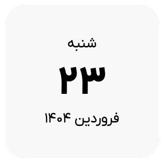

# 🗓️ ابزارک نمایش تاریخ شمسی (جلالی) برای Notion

یک ابزارک ساده و زیبا برای نمایش **تاریخ امروز به‌صورت شمسی** با طراحی مینیمال و فونت فارسی، مناسب برای استفاده مستقیم در صفحات Notion.

## 🔗 پیش‌نمایش آنلاین

👉 **برای استفاده در Notion، این آدرس را کپی کرده و به‌صورت Embed وارد کنید:**

```
https://pigment-dev.github.io/notion-jalali-calendar/
```

## 📌 نحوه استفاده در Notion

1. وارد صفحه‌ای در Notion شوید.
2. عبارت `/embed` را تایپ کرده و Enter بزنید.
3. آدرس ابزارک را که در بالا قرار دارد، جای‌گذاری کنید.
4. تاریخ امروز را به زیبایی در صفحه نوت‌شون خود مشاهده کنید!

## 🧰 امکانات

- نمایش **تاریخ شمسی امروز**
- با کلیک روی ابزارک، تاریخ به‌صورت `YYYY/MM/DD` کپی می‌شود

## 🧑‍💻 توسعه‌دهندگان

اگر می‌خواهید این ابزار را شخصی‌سازی یا روی دامنه خودتان میزبانی کنید، می‌توانید فایل `index.html` را به دلخواه ویرایش نمایید.

```bash
git clone https://github.com/pigment-dev/notion-jalali-calendar.git
```


## 🖼️ تصویر پیش‌نمایش




> 🧡 ساخته‌شده با عشق در اژانس پیگمنت برای جامعه فارسی‌ زبان 🧡